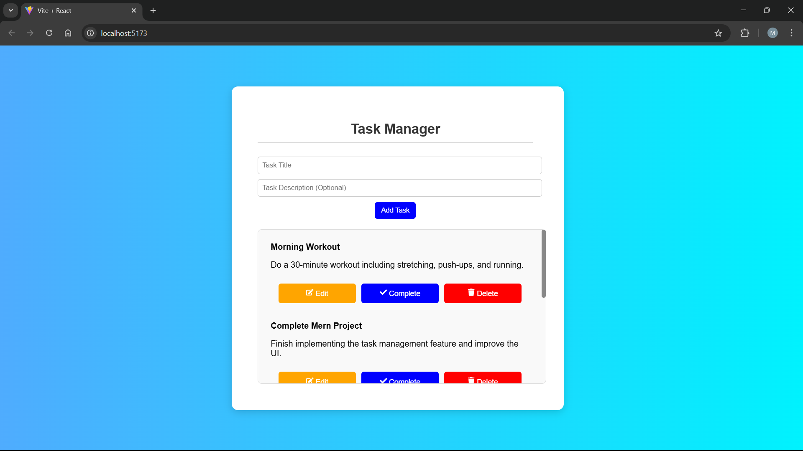

# 📝 Task Manager App (MERN) 🚀

A simple **Task Management** app built with **MongoDB, Express, React, and Node.js**.

## 📸 Screenshot  

---

## 🛠 Tech Stack  
- ⚛️ **Frontend**: React (Vite), Axios  
- 🖥 **Backend**: Node.js, Express, MongoDB  
- 🎨 **Styling**: CSS  

---

## 🚀 Features  
✅ Add, Edit, Delete Tasks  
✅ Mark Tasks as Completed  
✅ Responsive UI  
✅ Local Storage Support  

---

# 📥 Installation & Setup  

### **1️⃣ Clone the Repository**  
git clone https://github.com/asad-as1/Task-Manager.git
cd Task-Manager

2️⃣ Backend Setup
Navigate to the backend folder and install dependencies:

cd backend
npm install
🔹 Start the backend server:
npm run dev
✅ The backend is now running at:
http://localhost:5000

3️⃣ Frontend Setup
Open a new terminal, navigate to the frontend folder, and install dependencies:

cd frontend
npm install
🔹 Start the frontend:

npm run dev
✅ The frontend is now running at:
http://localhost:5173

📜 API Documentation
Base URL:
http://localhost:5000/api/tasks
1️⃣ Get All Tasks
🔹 Endpoint: GET /api/tasks
🔹 Description: Retrieves all tasks.
🔹 Response:

json
[
  {
    "_id": "6601f9a4c53b5b001e9d9f15",
    "title": "Complete React Project",
    "description": "Finish implementing the task manager",
    "completed": false,
    "createdAt": "2025-03-25T14:30:00.000Z",
    "updatedAt": "2025-03-25T14:30:00.000Z"
  }
]

2️⃣ Create a New Task
🔹 Endpoint: POST /api/tasks
🔹 Description: Creates a new task.
🔹 Request Body:

json
Copy
Edit
{
  "title": "Read a Book",
  "description": "Read 20 pages of 'Atomic Habits'"
}

🔹 Response:
json
{
  "_id": "6601f9a4c53b5b001e9d9f16",
  "title": "Read a Book",
  "description": "Read 20 pages of 'Atomic Habits'",
  "completed": false,
  "createdAt": "2025-03-25T15:00:00.000Z",
  "updatedAt": "2025-03-25T15:00:00.000Z"
}

3️⃣ Update a Task
🔹 Endpoint: PUT /api/tasks/:id
🔹 Description: Updates an existing task.
🔹 Request Body:

json
{
  "title": "Read a Book - Updated",
  "description": "Read 30 pages instead",
  "completed": true
}

🔹 Response:
json
{
  "_id": "6601f9a4c53b5b001e9d9f16",
  "title": "Read a Book - Updated",
  "description": "Read 30 pages instead",
  "completed": true,
  "createdAt": "2025-03-25T15:00:00.000Z",
  "updatedAt": "2025-03-25T15:15:00.000Z"
}

4️⃣ Delete a Task
🔹 Endpoint: DELETE /api/tasks/:id
🔹 Description: Deletes a task by ID.
🔹 Response:

json
{
  "message": "Task deleted successfully"
}

🔎 Testing the API
✅ 1️⃣ Test Using Postman
1️⃣ Open Postman
2️⃣ Use the following API endpoints:

GET: http://localhost:5000/api/tasks

POST: http://localhost:5000/api/tasks (Send JSON body)

PUT: http://localhost:5000/api/tasks/:id

DELETE: http://localhost:5000/api/tasks/:id

3️⃣ Check responses and verify that tasks are being updated in the database.

✅ 2️⃣ Test Using cURL
Get All Tasks
curl -X GET http://localhost:5000/api/tasks

Create a New Task
curl -X POST http://localhost:5000/api/tasks \
     -H "Content-Type: application/json" \
     -d '{"title": "Learn cURL", "description": "Use cURL to test APIs"}'

Update a Task
curl -X PUT http://localhost:5000/api/tasks/:id \
     -H "Content-Type: application/json" \
     -d '{"title": "Updated Task", "completed": true}'

Delete a Task
curl -X DELETE http://localhost:5000/api/tasks/:id

🎯 How to Use
1️⃣ Open the app and add a task
2️⃣ Mark tasks as completed when done ✅
3️⃣ Edit or Delete tasks if needed

